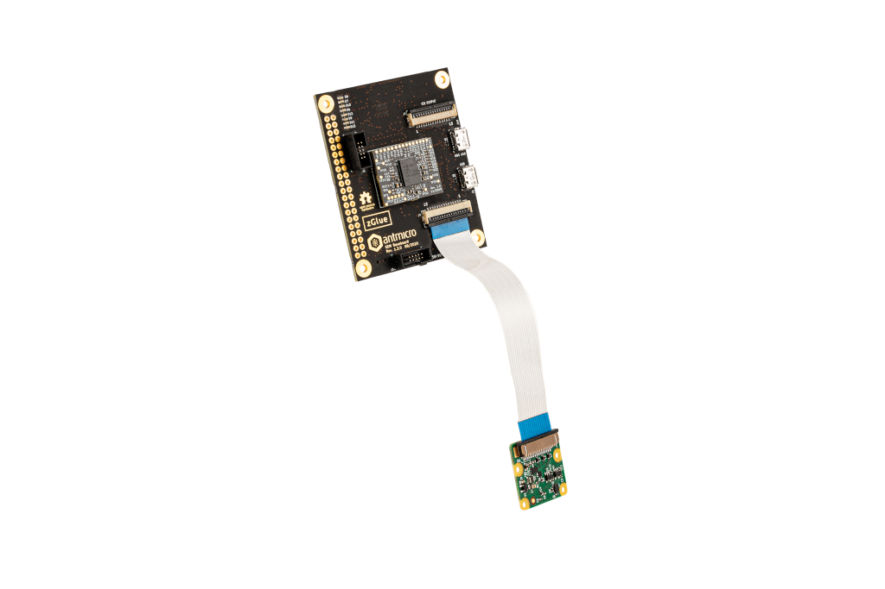

GEM Demo Board
==============

Copyright (c) 2020 `Antmicro <https://www.antmicro.com>`_

.. image:: https://img.shields.io/badge/View%20on-Antmicro%20Open%20Source%20Portal-332d37?style=flat-square
      :target: https://opensource.antmicro.com/projects/gem-baseboard
   

This repository contains PCB design files for a demo board compatible with the `GEM1 <https://github.com/antmicro/gem1-adapter>`_ and `GEM2 <https://github.com/antmicro/gem2-adapter>`_ adapter boards.

The board acts as an evaluation carrier board for the GEM adapter boards.
It includes a 4-channel FTDI USB/MPSSE converter that can be used for configuring the chiplets inside the GEM designs from an external host PC using a single USB connection and the MPSSE engine built into the FTDI controller.

The board contains two FFC connectors supporting MIPI CSI input and output.
The FFC connectors are pin-compatible with the Raspberry Pi camera interface.
It is possible to connect a Raspberry Pi camera module to the input connector on the board and provide processed CSI data back on the output CSI FFC.
It is also possible to configure the board as an expansion hat for the Raspberry Pi platform.
For more details regarding the supported connection scenarios please refer to the respective schematic sheets.

